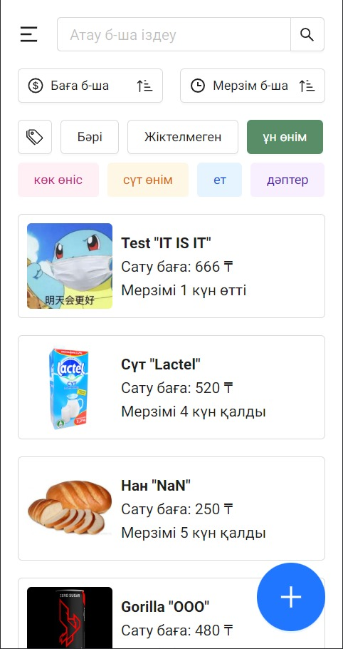
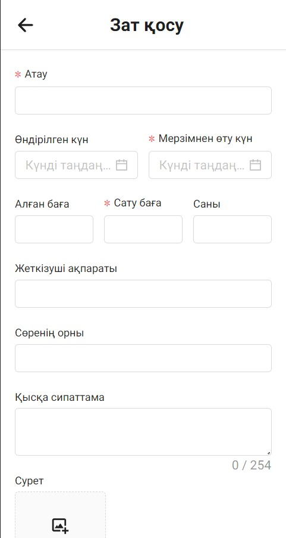
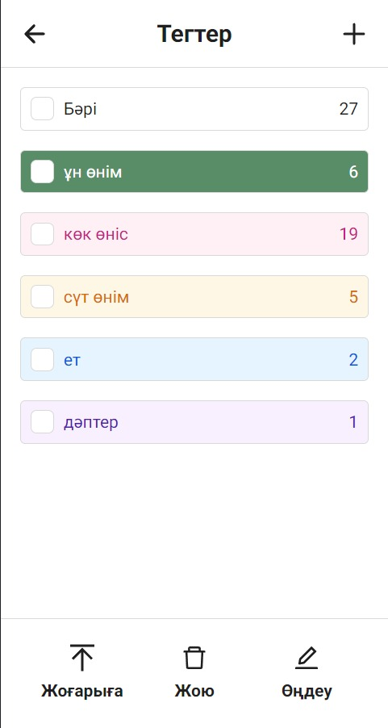
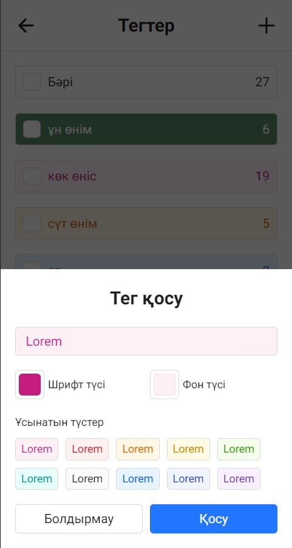
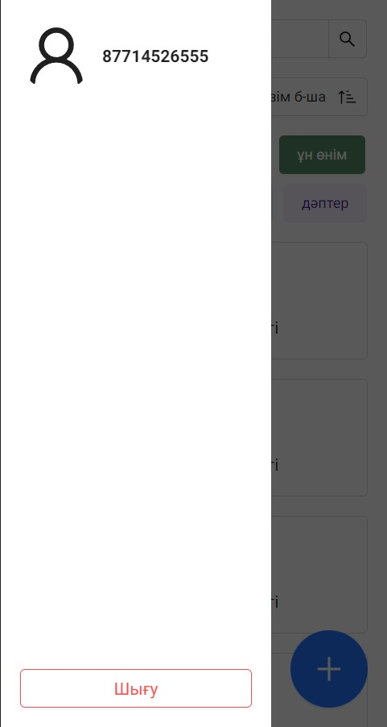

# Storehouse

> Storehouse — пайдаланушыларға қойма қорын тиімді басқаруға көмектесу үшін жасалған қойманы басқарудың жан-жақты қолданбасы.

# TODO

- 扫描条形码
- 添加商品时选择标签
- 添加修改个人消息的页面
- 添加意见箱
- 添加消息通知

# Нәтижелер

